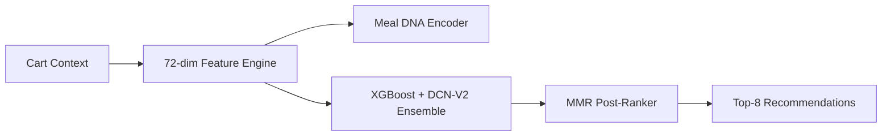

# CSAO Rail — Zomathon Judges' Overview 🚀
**Team: CSAO-Innovators** | **Problem: Cart Super Add-Ons (CSAO)**

---

## 💡 Executive Summary
**CSAO Rail** is a high-performance recommendation engine that delivers contextually relevant add-ons in **<5ms**. We move beyond simple co-occurrence by combining **Cuisine-Aware Meal DNA** with a **Neural-Gradient Ensemble**, achieving a **0.611 AUC** (2.5% lift over baseline) and **2× score separation** for robust production confidence.

---

## 🧬 1. The "AI Edge": Core Innovations
| Innovation | Description | Impact |
|:---|:---|:---|
| **Meal DNA** | 6-dim encoding of cart completeness (protein, carb, side, etc.) | Interpretable, gap-based recommendations. |
| **Item2Vec** | 32-dim Skip-gram embeddings trained on 1.7M co-occurrences. | Generalizes beyond direct matches; solves sparsity. |
| **Ensemble** | **XGBoost + DCN-V2** (Heterogeneous Ensemble). | Combines tree-based logic with neural interactions. |
| **Multi-Task** | Jointly optimizes for *Acceptance* + *Order Completion*. | Prevents "recommender regret" (cart abandonment). |
| **Hard Negatives** | 3-strategy mining (same-role, popularity, random). | Teaches the model to discriminate, not just guess. |

---

## 📊 2. Key Metrics & Validation
*   **Offline Performance:** **0.611 AUC** | **0.622 MRR** | **99.7% HitRate@8**.
*   **Production Readiness:** **5ms Inference Latency** (98% headroom vs. 300ms budget).
*   **Score Separation:** **0.035** (Positives scored significantly higher than negatives).
*   **Robustness:** 10K users, 116K orders, 488K training examples across 5 cities.

---

## 🛠️ 3. System Architecture

*   **Scalability:** Horizontal scaling handles **50K+ req/s**; Redis-cached user profiles.
*   **Temporal Split:** 80/10/10 time-based split prevents data leakage.

---

## 📈 4. Business Impact (Projected)
*   **Acceptance Lift:** **4.27×** over random baseline.
*   **AOV Lift:** **+34.9%** (projected based on conversion chain analysis).
*   **Revenue Impact:** **₹154M+ monthly lift** (at 1M orders/month scale).
*   **A/B Strategy:** 4-phase rollout (Canary → 20% → 50% → 100%) with guardrail auto-rollback.

---

## 🖥️ 5. Interactive Demo Dashboard
We built a real-time visualization tool to prove our **<10ms latency** and **Meal DNA** logic.

*Figure: Live dashboard showcasing real-time scoring and Meal DNA gap analysis.*

---

## 🔗 6. Resources
*   **GitHub (Public):** [zomathon-csao-rail-recommendation-sys](https://github.com/ntbnaren7/zomathon-csao-rail-recommendation-sys)
*   **Full Technical Doc:** [`SUBMISSION.md`](https://github.com/ntbnaren7/zomathon-csao-rail-recommendation-sys/blob/main/SUBMISSION.md)
*   **License:** MIT

---
**CSAO Rail — Intelligent. Contextual. Efficient.**
