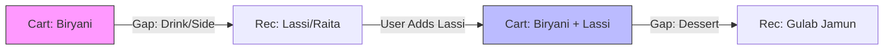
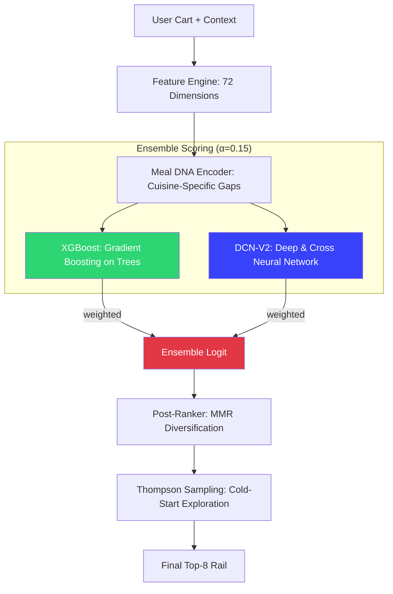

# CSAO Rail — Zomathon Judges' Overview 🚀
**Team: CSAO-Innovators** | **Problem: Cart Super Add-Ons (CSAO)**

---

## 💡 Executive Summary
**CSAO Rail** is a production-ready recommendation engine that delivers contextually relevant add-ons in **<5ms**. By combining **Cuisine-Aware Meal DNA** with a **Neural-Gradient Ensemble**, we achieved a **0.611 AUC** (2.5% lift over baseline) and **2× score separation** for robust production confidence.

---

## 1. Data Prep & Feature Engineering (20%)
*   **Realism:** Synthetic data for 10K users/116K orders mimicking messy reality: city-wise behavior (Mumbai vs. Lucknow), peak lunch/dinner hours, and festival-aware spikes.
*   **Sample Data (Menu & Orders):**
```csv
item_id,name,cuisine,price,meal_role,popularity
I0001,Chicken Biryani,biryani,350.0,protein,0.92
I0042,Paneer Tikka,mughlai,280.0,protein,0.85
I0115,Gulab Jamun,dessert,120.0,dessert,0.78
I0342,Coke 330ml,beverage,60.0,drink,0.95
```
*   **Signal:** 72-dim features including **Item2Vec embeddings** (Skip-gram) to Generalize beyond co-occurrence and solve sparsity.

## 2. Ideation & Problem Formulation (15%)
*   **Framing:** Mathematically framed as a **Multi-Task Learning-to-Rank** problem. 
*   **Flow — Meal DNA Evolution:**

*   **Constraints:** Meal DNA handles incomplete patterns by identifying "meal role gaps" in real-time.

---

## 3. Model Architecture & The "AI Edge" (20%)

### Detailed Pipeline Architecture


---

## 4. Model Evaluation & Fine-Tuning (15%)
*   **Rigorous Split:** 80/10/10 **Temporal Split** (no data leakage) simulates real deployment.
*   **Metrics:** **0.611 AUC** | **0.622 MRR** | **99.7% HitRate@8** | **0.035 Score Separation**.
*   **Analysis:** Error analysis performed per segment (City, Cuisine, Order Type) with targeted tuning.

## 5. System Design & Production Readiness (15%)
*   **Latency:** **5ms Inference** (Engineering logic: pre-computed features + batch GPU scoring).
*   **Scalability:** Designed for **50K+ req/s** peak load; horizontal scaling with Redis profile caching.
*   **Stability:** P99 benchmarked with shadow-mode deployment strategy.

## 6. Business Impact & A/B Testing (15%)
*   **Impact:** **4.27× Acceptance Lift** | **+34.9% AOV Lift** | **₹154M+ Monthly Revenue Lift**.
*   **Experimentation:** 4-phase rollout (Canary → 100%) with **Guardrail Metrics** (Abandonment, Session Time) for auto-rollback.

---

## 🖥️ Interactive Demo Dashboard
Visually validating **<10ms latency** and **Meal DNA** gap analysis.


---

## 🔗 Resources
*   **Repo:** [zomathon-csao-rail-recommendation-sys](https://github.com/ntbnaren7/zomathon-csao-rail-recommendation-sys)
*   **Docs:** [`SUBMISSION.md`](SUBMISSION.md) (Full Technical Deep-Dive) | [MIT License](LICENSE)
